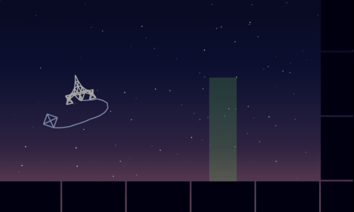

Delivery Force

A game prototype I made in about 40 hours for the Lodum Dare Compo (May 2023)
It's a 2D low gravity space delivery game, inspired by Gravity Force II (Amiga 500)

**Controls: Arrow keys + Space** (hold down space to grab using the wire/rope)

**NOTE: If your ship breaks and you cannot control it any longer, you have to hit F5 manually**

My plan was to have a protection shield so you can actually bounce (limited times, or limited time window), then when your shield is no longer available, the ship should shatter on impact, and then the game should reset. however... not enough time, spent too much time messing with the softbody stuff I guess...

It's about ~900 lines of js (canvas 2d API), music/sounds created in Reaper using Synth1 by Daichi. 

Changes from the original version: 
    * fixed timing issues on systems not using 60hz displays
    * added stars to give a better sense of travel